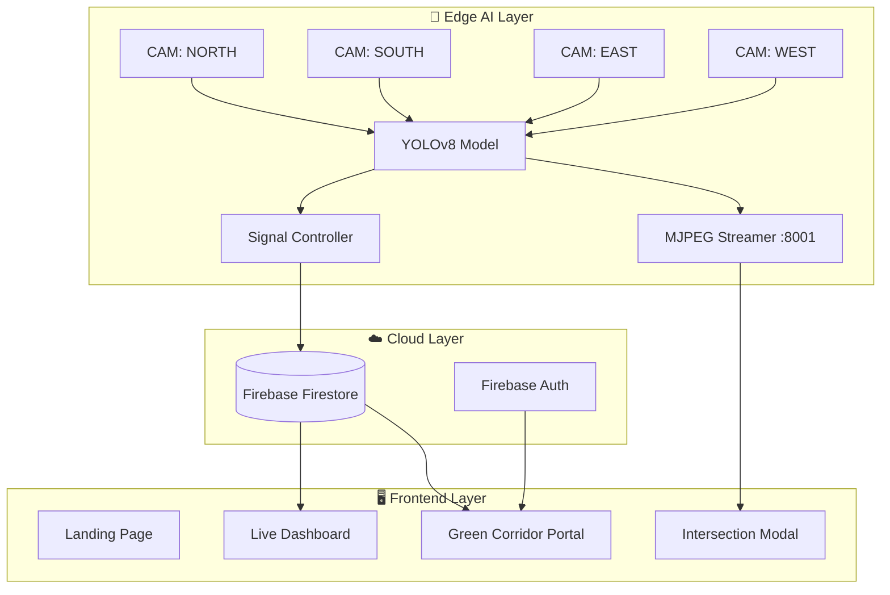

<div align="center">


# SignalSync

### AI-Powered Intelligent Traffic Management & Emergency Response System

[](https://nextjs.org/)
[](https://docs.ultralytics.com/)
[](https://firebase.google.com/)
[](https://developers.google.com/maps)
[](https://tailwindcss.com/)
[](https://python.org/)

**Team Merge_Conflicts · India Innovates Hackathon 2026**

*Restoring the Golden Hour — one green signal at a time.*

[Live Demo](#-getting-started) · [Architecture](#-system-architecture) · [Edge AI](#-edge-ai-module) · [Setup Guide](#-getting-started)

</div>

---

## 📋 Table of Contents

- [Overview](#-overview)
- [The Problem](#-the-problem)
- [Our Solution](#-our-solution)
- [System Architecture](#-system-architecture)
- [Key Features](#-key-features)
- [Edge AI Module](#-edge-ai-module)
- [Tech Stack](#-tech-stack)
- [Project Structure](#-project-structure)
- [Getting Started](#-getting-started)
- [Environment Variables](#-environment-variables)
- [Pages & Routes](#-pages--routes)
- [Green Corridor System](#-green-corridor-system)
- [Signal Control Logic](#-signal-control-logic)
- [City Coverage](#-city-coverage)
- [Firebase Setup](#-firebase-setup)
- [Team](#-team)
- [License](#-license)

---

## 🌐 Overview

**SignalSync** is a full-stack AI-powered traffic management platform that combines **real-time computer vision** (YOLOv8), **dynamic signal control**, and **emergency green corridor management** to tackle India's most critical urban mobility challenges.

Built by **Team Merge_Conflicts** for the **India Innovates Hackathon 2026**, SignalSync demonstrates how edge AI and connected infrastructure can save lives during the critical **Golden Hour** — the 60-minute window where timely medical intervention can mean the difference between life and death.

> **💡 Key Insight:** Ambulances in Indian cities spend **10–15% of their journey time** stuck at red lights. SignalSync eliminates that delay entirely.

---

## 🚨 The Problem

<div align="center">

| Problem | Impact |
|---------|--------|
| 🏥 **Red-light delays for ambulances** | 10–15% of Golden Hour lost idling at signals |
| 🚦 **Fixed-timer traffic signals** | Waste fuel on empty lanes, ignore real-time density |
| 🛡️ **VVIP convoy security** | Stopped convoys become static security targets |
| 📊 **No real-time visibility** | Traffic control rooms lack live intersection intelligence |
| 🔇 **No automated preemption** | Signal override requires manual radio coordination |

</div>

---

## 💡 Our Solution

SignalSync operates on **three integrated pillars**:

```
┌──────────────────────────────────────────────────────────────────┐
│                          SIGNALSYNC                              │
├──────────────────┬──────────────────┬────────────────────────────┤
│   🎯 AI VISION   │  🟢 GREEN WAVE   │    📊 LIVE DASHBOARD      │
│                  │                  │                            │
│  YOLOv8 detects  │  Dispatcher      │  City-wide traffic        │
│  vehicles at     │  creates a       │  control center with      │
│  every inter-    │  zero-stop       │  real-time node status,   │
│  section in      │  signal priority │  active corridors, and    │
│  real-time       │  path for        │  AI-powered density       │
│                  │  ambulances      │  analytics                │
├──────────────────┼──────────────────┼────────────────────────────┤
│  4-cam pipeline  │  GPS tracking    │  Signal cycle control     │
│  N/S/E/W feeds   │  Auto-terminate  │  Manual + AI override     │
│  Edge processing │  Firebase sync   │  Emergency detection      │
└──────────────────┴──────────────────┴────────────────────────────┘
```

---

## 🏗️ System Architecture



**Data Flow:**
1. **Edge cameras** feed video into YOLOv8 for real-time vehicle detection
2. **Signal Controller** analyzes N/S vs E/W density → dynamically assigns GREEN to the denser axis
3. **MJPEG Streamer** serves annotated video feeds with bounding boxes to the dashboard
4. **Firebase Firestore** syncs signal states, corridor data, and intersection stats in real-time
5. **Dashboard** displays live feeds, signal status, and emergency override controls

---

## ✨ Key Features

### 🏠 Landing Page (`/`)
- Visuo-inspired dark violet-black aesthetic with animated purple spotlight
- Animated intersection hero with traffic light cycling N/S ↔ E/W phases
- Problem statement, three-pillar architecture breakdown, user flow diagrams
- Multi-language support (English, Hindi, Kannada, Telugu, Tamil, Marathi, Bengali, Gujarati)

### 📊 Live Dashboard (`/dashboard`)
- **City picker** — 8 major Indian cities with instant data refresh
- **AI Camera Network** — 6 real named intersections per city with live YOLO density
- **4-Direction Intersection Modal** — click any camera to open the N/S/E/W quad-view with:
  - Real-time YOLO bounding boxes on each direction's video feed
  - Independent signal poles per direction (GREEN/YELLOW/RED)
  - Live density percentage and vehicle count per direction
  - Traffic status banners (FLOWING / STOPPED / CLEARING)
- **Signal Control Panel** — traffic light status, countdown timer, N/S vs E/W density bar
- **Manual Override Controls** — Force Green, Force Red, Reset Auto per intersection
- **Emergency Detection** — Force Emergency button simulates ambulance detection cascade
- **IoT Auto-Preemption** — GPS-based signal preemption when ambulance is within 500m
- **Live Green Corridors** — polls Firestore + localStorage every 1.5s for active corridors
- **System Log** — timestamped event log showing all signal changes and detections

### 🗺️ Green Corridor Portal (`/portal`)
- **📍 Use My Location** — one-tap GPS auto-fill using Browser Geolocation API
- **Route Finder** — Google Directions API with live traffic-aware routing (departure-time + `BEST_GUESS`)
- **Initiate Green Wave** — saves corridor to Firestore, auto-selects 5 intersections along the route
- **CorridorStatusBox** — animated GREEN ✓ / PREP ⏱ / QUEUED status per node
- **Traffic signal overlays** — colored rings at each node on the Google Map
- **Live GPS Tracking** — `watchPosition()` tracks vehicle with pulsing blue dot, map auto-recenters
- **Auto-terminate** — corridor removed from Firestore + localStorage 2.5s after arrival

### 🔐 Authentication (`/auth/login`, `/auth/register`)
- Firebase Authentication (Email/Password)
- Role-based access control — `admin` role unlocks full signal override panel

### ⚙️ Admin Panel (`/admin`)
- Admin-only route guarded by Firestore role check
- Full signal override capabilities

---

## 🤖 Edge AI Module

The `edge-sim/` directory contains the **Python-based Edge AI processing pipeline** — the brain of SignalSync's real-time traffic intelligence.

### Components

| File | Purpose |
|------|---------|
| `streamer.py` | 4-direction pipelined YOLO streamer with MJPEG output and signal control |
| `runner.py` | Standalone YOLO runner that pushes emergency events to Firebase |
| `firebase_client.py` | Firebase Admin SDK client for pushing intersection stats and events |
| `yolov8n.pt` | Pre-trained YOLOv8n model weights |

### How It Works

```
┌─────────────┐     ┌──────────────────┐     ┌─────────────────┐
│  4 Video     │────▶│  YOLOv8 Inference │────▶│  Frame Buffer   │
│  Sources     │     │  (every 4th frame)│     │  (3.5s batches) │
│  N/S/E/W     │     │                  │     │                 │
└─────────────┘     └──────────────────┘     └────────┬────────┘
                                                       │
                    ┌──────────────────┐               │
                    │  Signal          │◀──────────────┘
                    │  Controller      │     density stats
                    │  (1s tick)       │
                    └────────┬─────────┘
                             │
                    ┌────────▼─────────┐     ┌─────────────────┐
                    │  MJPEG Stream    │────▶│  Dashboard       │
                    │  :8001           │     │  (Browser)       │
                    └────────┬─────────┘     └─────────────────┘
                             │
                    ┌────────▼─────────┐
                    │  Firebase Push   │
                    │  (2s interval)   │
                    └──────────────────┘
```

### Per-Direction Video Pipeline

Each direction (NORTH, SOUTH, EAST, WEST) has its **own dedicated video file** and processing pipeline:

| Direction | Video Source | Axis |
|-----------|------------|------|
| NORTH | `demo.mp4` | N/S |
| SOUTH | `WhatsApp Video 1.mp4` | N/S |
| EAST | `WhatsApp Video 2.mp4` | E/W |
| WEST | `WhatsApp Video 3.mp4` | E/W |

Each pipeline runs in its own thread with double-buffered frame processing for smooth, gap-free MJPEG streaming at 20fps.

### API Endpoints (Port 8001)

| Endpoint | Method | Description |
|----------|--------|-------------|
| `/video_feed/{direction}` | GET | MJPEG stream for NORTH/SOUTH/EAST/WEST |
| `/signal_state` | GET | Current signal phase, mode, and axis densities |
| `/signal_override` | POST | Admin-only manual signal phase lock |
| `/stats` | GET | Per-direction YOLO detection stats |
| `/stats/{direction}` | GET | Stats for a single direction |
| `/health` | GET | Service health check with pipeline readiness |

---

## 🛠️ Tech Stack

<div align="center">

| Layer | Technology | Purpose |
|-------|-----------|---------|
| **Frontend** | Next.js 16 (App Router) | React-based SSR/CSR application |
| **Styling** | Tailwind CSS 3 + Custom CSS tokens | Dark-mode design system with Visuo aesthetic |
| **Maps** | Google Maps JavaScript API | Maps, Directions, Places Autocomplete |
| **GPS** | Browser Geolocation API | Real-time vehicle tracking |
| **Auth** | Firebase Authentication | Email/Password login with role-based access |
| **Database** | Cloud Firestore | Real-time corridor sync and intersection stats |
| **AI/ML** | YOLOv8n (Ultralytics) | Real-time vehicle detection and classification |
| **Video** | OpenCV + MJPEG | 4-direction video processing and streaming |
| **Backend** | FastAPI + Uvicorn | Edge AI REST API and MJPEG streamer |
| **IoT** | Firebase Realtime Signals | GPS-based ambulance geofence preemption |
| **i18n** | Custom LanguageProvider | 8-language support (EN, HI, KN, TE, TA, MR, BN, GU) |

</div>

---

## 📁 Project Structure

```
India_Innovates_Merge_Conflicts/
│
├── README.md                          ← You are here
├── start-backend.ps1                  ← One-click backend launcher (all 4 services)
├── start-frontend.ps1                 ← Frontend dev server launcher
├── yolov8n.pt                         ← YOLO model weights
│
├── edge-sim/                          ← 🤖 Edge AI Processing Module
│   ├── streamer.py                    # 4-direction YOLO streamer + signal controller
│   ├── runner.py                      # Standalone YOLO runner → Firebase events
│   ├── firebase_client.py             # Firebase Admin SDK push client
│   ├── requirements.txt               # Python dependencies
│   ├── serviceAccountKey.json         # 🔑 Firebase service account (gitignored)
│   ├── yolov8n.pt                     # YOLOv8n model weights
│   ├── demo.mp4                       # NORTH camera demo video
│   ├── WhatsApp Video 1.mp4           # SOUTH camera demo video
│   ├── WhatsApp Video 2.mp4           # EAST camera demo video
│   └── WhatsApp Video 3.mp4           # WEST camera demo video
│
└── signal-sync/                       ← 🖥️ Next.js Frontend Application
    ├── app/
    │   ├── layout.jsx                 # Root layout — AuthProvider, fonts, global styles
    │   ├── globals.css                # Design tokens, Visuo theme, animations
    │   ├── page.jsx                   # Landing page — animated hero, problem, pillars
    │   ├── dashboard/
    │   │   └── page.jsx               # Live city dashboard — AI cameras, corridors
    │   ├── portal/
    │   │   └── page.jsx               # Green corridor creation & GPS navigation
    │   ├── routes/
    │   │   └── page.jsx               # Standalone route finder
    │   ├── admin/
    │   │   └── page.jsx               # Admin panel (role-gated)
    │   ├── profile/
    │   │   └── page.jsx               # User profile page
    │   └── auth/
    │       ├── login/page.jsx         # Sign-in page
    │       └── register/page.jsx      # Registration page
    │
    ├── components/
    │   ├── YoloFailsafePanel.jsx      # 6-camera AI grid with signal control
    │   ├── IntersectionModal.jsx       # 4-direction N/S/E/W expanded view
    │   ├── DelhiMap.jsx               # Google Maps with GPS, overlays, directions
    │   ├── CorridorStatusBox.jsx       # Animated GREEN/PREP/QUEUED status
    │   ├── DemoCorridorStatus.jsx      # Demo corridor animation
    │   ├── Navbar.jsx                 # Navigation bar
    │   ├── Chatbot.jsx                # In-app chatbot
    │   ├── AuthProvider.jsx           # Firebase auth context + Firestore profile
    │   ├── LanguageProvider.jsx        # Multi-language context provider
    │   └── LanguagePicker.jsx         # Language selection dropdown
    │
    ├── lib/
    │   ├── firebase.js                # Firebase app + Auth + Firestore init
    │   ├── firestore.js               # Firestore helpers — corridors, signals
    │   ├── cityNodes.js               # Real intersection data for 8 cities
    │   └── i18n.js                    # Translation strings (8 languages)
    │
    ├── public/
    │   ├── logo.png                   # SignalSync logo
    │   ├── cam-north.mp4              # Fallback video — NORTH direction
    │   ├── cam-south.mp4              # Fallback video — SOUTH direction
    │   ├── cam-east.mp4               # Fallback video — EAST direction
    │   └── cam-west.mp4               # Fallback video — WEST direction
    │
    ├── .env.local                     # 🔑 Environment variables (gitignored)
    ├── next.config.js
    ├── tailwind.config.js
    ├── postcss.config.js
    └── package.json
```

---

## 🚀 Getting Started

### Prerequisites

| Requirement | Version | Installation |
|-------------|---------|-------------|
| **Node.js** | ≥ 18 LTS | [nodejs.org](https://nodejs.org) |
| **Python** | ≥ 3.10 | [python.org](https://python.org) |
| **pip** | Latest | Comes with Python |
| **Google Cloud** | — | Maps JS API, Directions API, Places API enabled |
| **Firebase** | — | Auth (Email/Password) + Cloud Firestore |

### Step 1 — Clone the Repository

```bash
git clone https://github.com/Aniruddha1406/India_Innovates_Merge_Conflicts.git
cd India_Innovates_Merge_Conflicts
```

### Step 2 — Install Frontend Dependencies

```bash
cd signal-sync
npm install
```

> ⚠️ If `npm install` fails with peer dependency errors, use `npm install --force`

### Step 3 — Install Edge AI Dependencies

```bash
cd edge-sim
pip install -r requirements.txt
```

**Required Python packages:**
- `ultralytics` (YOLOv8)
- `opencv-python`
- `fastapi`
- `uvicorn`
- `firebase-admin`

### Step 4 — Configure Environment Variables

Create `signal-sync/.env.local`:

```env
# ── Google Maps ──────────────────────────────────────────
NEXT_PUBLIC_GOOGLE_MAPS_API_KEY=your_google_maps_api_key

# ── Firebase (Client SDK) ────────────────────────────────
NEXT_PUBLIC_FIREBASE_API_KEY=your_firebase_api_key
NEXT_PUBLIC_FIREBASE_AUTH_DOMAIN=your_project.firebaseapp.com
NEXT_PUBLIC_FIREBASE_PROJECT_ID=your_project_id
NEXT_PUBLIC_FIREBASE_STORAGE_BUCKET=your_project.appspot.com
NEXT_PUBLIC_FIREBASE_MESSAGING_SENDER_ID=your_sender_id
NEXT_PUBLIC_FIREBASE_APP_ID=your_app_id
```

Place your Firebase Admin SDK service account key at:
```
edge-sim/serviceAccountKey.json
```

> 🔐 Both `.env.local` and `serviceAccountKey.json` are gitignored. Never commit credentials.

### Step 5 — Launch Everything

**Option A: One-click launch (Windows PowerShell)**

```powershell
# Terminal 1 — All backend services
.\start-backend.ps1

# Terminal 2 — Frontend dev server
.\start-frontend.ps1
```

**Option B: Manual launch**

```bash
# Terminal 1 — FastAPI Backend (port 5000)
cd backend
python -m uvicorn main:app --port 5000 --reload

# Terminal 2 — YOLO Streamer (port 8001)
cd edge-sim
python streamer.py --video-north demo.mp4 --video-south "WhatsApp Video 1.mp4" --video-east "WhatsApp Video 2.mp4" --video-west "WhatsApp Video 3.mp4" --port 8001

# Terminal 3 — YOLO Runner (Firebase events)
cd edge-sim
python runner.py --video demo.mp4 --headless

# Terminal 4 — Next.js Frontend (port 3000)
cd signal-sync
npm run dev
```

### Step 6 — Open in Browser

| Service | URL | Description |
|---------|-----|-------------|
| **Frontend** | [http://localhost:3000](http://localhost:3000) | SignalSync web application |
| **YOLO Streamer** | [http://localhost:8001/health](http://localhost:8001/health) | Edge AI health check |
| **YOLO Feeds** | [http://localhost:8001/video_feed/NORTH](http://localhost:8001/video_feed/NORTH) | Live MJPEG stream |

---

## 🔑 Environment Variables

| Variable | Required | Description |
|----------|----------|-------------|
| `NEXT_PUBLIC_GOOGLE_MAPS_API_KEY` | ✅ | Google Maps JavaScript API key |
| `NEXT_PUBLIC_FIREBASE_API_KEY` | ✅ | Firebase project API key |
| `NEXT_PUBLIC_FIREBASE_AUTH_DOMAIN` | ✅ | Firebase Auth domain |
| `NEXT_PUBLIC_FIREBASE_PROJECT_ID` | ✅ | Firebase project ID |
| `NEXT_PUBLIC_FIREBASE_STORAGE_BUCKET` | ✅ | Firebase Storage bucket |
| `NEXT_PUBLIC_FIREBASE_MESSAGING_SENDER_ID` | ✅ | Firebase Cloud Messaging sender ID |
| `NEXT_PUBLIC_FIREBASE_APP_ID` | ✅ | Firebase app ID |

> All `NEXT_PUBLIC_` prefixed variables are exposed to the browser. Admin/secret keys go in `serviceAccountKey.json` only.

---

## 📄 Pages & Routes

| Route | Page | Auth | Description |
|-------|------|------|-------------|
| `/` | Landing Page | No | Animated hero, problem statement, solution pillars, user flows |
| `/dashboard` | Live Dashboard | No | City-wide AI camera network, signal control, corridors |
| `/portal` | Green Corridor | Yes* | Create corridors, GPS tracking, real-time signal override |
| `/routes` | Route Finder | No | Standalone route search with city-bounded autocomplete |
| `/admin` | Admin Panel | Admin | Signal override, system management |
| `/profile` | User Profile | Yes | User account settings |
| `/auth/login` | Sign In | No | Email/password authentication |
| `/auth/register` | Sign Up | No | New account creation |

*\*Basic features accessible without auth; full corridor creation requires sign-in.*

---

## 🚑 Green Corridor System

### End-to-End Flow

```
 ① Operator opens /portal
    └─▶ Selects city → Enters origin & destination
         └─▶ [Optional] Tap 📍 for GPS auto-fill

 ② Clicks "Get Best Route"  
    └─▶ Google Directions API fetches traffic-aware route
         └─▶ Live departure-time model with BEST_GUESS traffic

 ③ Clicks "Initiate Green Wave"
    └─▶ pickCorridorNodes() selects 5 real intersections along the route
    └─▶ Corridor saved to Firestore + localStorage  
    └─▶ Signal circle overlays appear on map (🟢 🟡 🔴)

 ④ Demo ambulance drives the route on the map
    └─▶ Each node triggers onNodeAdvance() callback
    └─▶ CorridorStatusBox updates: GREEN → PREP → QUEUED cascade
    └─▶ Dashboard polls localStorage every 1.5s and mirrors status

 ⑤ [Physical travel] Tap "Start Live GPS Tracking"
    └─▶ watchPosition() tracks vehicle with pulsing blue dot
    └─▶ Map auto-recenters at zoom level 15

 ⑥ Vehicle arrives at destination
    └─▶ Auto-terminate fires after 2.5s grace period
    └─▶ Corridor removed from Firestore + localStorage
    └─▶ All signals return to normal cycle
```

### Signal States

| State | Visual | Description |
|-------|--------|-------------|
| `GREEN ✓` | 🟢 Green circle | Ambulance at intersection — full green priority |
| `PREP ⏱` | 🟡 Amber circle | Next intersection — signal preparing to clear |
| `QUEUED` | 🔴 Red circle | Downstream — cross-traffic held at red |
| `✓ CLEAR` | ⚪ Dim green | Ambulance passed — signal returned to normal |

---

## 🚦 Signal Control Logic

The signal controller in `streamer.py` runs every **1 second** and uses a hybrid approach:

### Dynamic Mode (Density Difference > 10%)
```
IF avg(N/S density) > avg(E/W density) + 10%:
    → N/S axis gets GREEN, E/W gets RED
    
IF avg(E/W density) > avg(N/S density) + 10%:
    → E/W axis gets GREEN, N/S gets RED
```

### Fixed Cycle Mode (Balanced Traffic)
```
GREEN  (20s) → YELLOW (3s buffer) → RED (15s) → swap axes → repeat
```

### Emergency Override
```
Ambulance detected by YOLO → ALL signals YELLOW (3s) → 
    Detection node: GREEN (corridor clear)
    All other nodes: RED (cross-traffic stopped)
    → Auto-clear after vehicle passes
```

### Priority Hierarchy
```
IoT Geofence Preemption > Emergency YOLO Detection > Manual Override > Auto Cycle
```

---

## 🏙️ City Coverage

SignalSync covers **8 major Indian cities** with **17–20 real named intersections** per city:

| City | State | Sample Intersections |
|------|-------|---------------------|
| 🏛️ **Delhi** | Delhi NCR | Connaught Place, AIIMS, Karol Bagh, IGI Terminal 3, Lajpat Nagar |
| 🌊 **Mumbai** | Maharashtra | Dadar TT Circle, BKC, Andheri Junction, Mahim Causeway, Borivali |
| 🌳 **Bengaluru** | Karnataka | Silk Board Junction, Hebbal Flyover, Marathahalli, Whitefield |
| 🕌 **Hyderabad** | Telangana | Hitech City, Jubilee Hills, Ameerpet, Gachibowli, Charminar |
| 🏖️ **Chennai** | Tamil Nadu | Anna Salai, T. Nagar Pondy Bazaar, Koyambedu Hub, Guindy |
| ⛰️ **Pune** | Maharashtra | Shivajinagar, Swargate, Hadapsar, Hinjewadi Phase 1 |
| 🌉 **Kolkata** | West Bengal | Esplanade Crossing, Park Street, Gariahat More, Howrah Station |
| 🏗️ **Ahmedabad** | Gujarat | ISCON Circle, Navrangpura, SG Highway, Shivranjani Cross Rd |

All intersection data with real GPS coordinates is stored in `signal-sync/lib/cityNodes.js`.

---

## 🔥 Firebase Setup

### Required Services
1. **Authentication** → Enable Email/Password sign-in method
2. **Cloud Firestore** → Create database in production mode

### Firestore Collections

| Collection | Purpose |
|-----------|---------|
| `users` | User profiles with role field |
| `corridors` | Active green corridor data |
| `edge_events` | YOLO emergency detection events |
| `intersection_stats` | Per-camera density and vehicle data |
| `signals` | Real-time signal state per intersection |

### Recommended Security Rules

```javascript
rules_version = '2';
service cloud.firestore {
  match /databases/{database}/documents {
    // Users — only the owner can read/write their profile
    match /users/{uid} {
      allow read, write: if request.auth.uid == uid;
    }
    // Corridors — authenticated users can create; owner/admin can modify
    match /corridors/{corridorId} {
      allow read: if true;
      allow create: if request.auth != null;
      allow update, delete: if request.auth != null &&
        (resource.data.uid == request.auth.uid ||
         get(/databases/$(database)/documents/users/$(request.auth.uid)).data.role == 'admin');
    }
    // Edge events & stats — read-only for clients; server writes via Admin SDK
    match /edge_events/{doc} {
      allow read: if true;
    }
    match /intersection_stats/{doc} {
      allow read: if true;
    }
    match /signals/{doc} {
      allow read: if true;
    }
  }
}
```

---

## 📞 Emergency Numbers (India)

| Service | Number |
|---------|--------|
| 🚑 Ambulance | **102** |
| 🚒 Fire Brigade | **101** |
| 👮 Police | **100** |
| 🏥 All Emergencies (GVK EMRI) | **108** |

---

## 🤝 Team

<div align="center">

**Team Merge_Conflicts**

*India Innovates Hackathon 2026*

| Area | Contribution |
|------|-------------|
| 🖥️ Full-Stack Development | Next.js 16 app, Firebase integration, Google Maps API |
| 🤖 AI/ML Engineering | YOLOv8 pipeline, 4-direction video processing, signal control |
| 🎨 UI/UX Design | Dark-mode Visuo design system, animations, responsive layout |
| 📊 Data Research | Real intersection GPS coordinates for 8 Indian cities |
| 🏗️ System Architecture | Green corridor algorithm, real-time signal sync, IoT preemption |

</div>

---

## 📄 License

This project is licensed under the MIT License — see the [LICENSE](LICENSE) file for details.

---

<div align="center">


**SignalSync** · *Restoring the Golden Hour*

Built with ❤️ by [Team Merge_Conflicts](https://github.com/Aniruddha1406/India_Innovates_Merge_Conflicts)

*India Innovates Hackathon · 2026*

</div>
