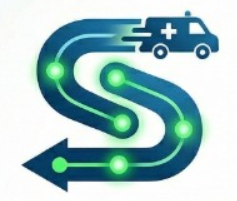

<div align="center">



# SignalSync — Edge AI Module

### Real-Time YOLOv8 Vehicle Detection & Adaptive Signal Control

[](https://docs.ultralytics.com/)
[](https://fastapi.tiangolo.com/)
[](https://opencv.org/)
[](https://firebase.google.com/)

*The intelligent edge processing layer powering SignalSync's real-time traffic intelligence.*

</div>

---

## 📋 Table of Contents

- [Overview](#-overview)
- [Architecture](#-architecture)
- [Components](#-components)
- [Quick Start](#-quick-start)
- [4-Direction Video Pipeline](#-4-direction-video-pipeline)
- [Signal Control Logic](#-signal-control-logic)
- [API Reference](#-api-reference)
- [Firebase Integration](#-firebase-integration)
- [Configuration](#-configuration)
- [Files](#-files)

---

## 🌐 Overview

The Edge AI module simulates a network of **street-level compute units** (designed for NVIDIA Jetson Nano deployment). It processes traffic video feeds through **YOLOv8n** in real-time to:

1. **Detect and classify vehicles** — cars, motorcycles, buses, trucks, bicycles, ambulances
2. **Calculate per-direction density** — N/S vs E/W vehicle coverage percentage
3. **Dynamically control signals** — busier axis gets GREEN, with 3s yellow buffer transitions
4. **Detect emergency vehicles** — ambulances trigger instant green corridor override
5. **Stream annotated video** — MJPEG feeds with bounding boxes to the Next.js dashboard
6. **Push stats to Firebase** — real-time density and event data for cloud sync

---

## 🏗️ Architecture

```
┌──────────────────────────────────────────────────────────────────────┐
│                       EDGE AI PROCESSING NODE                       │
├──────────────────────────────────────────────────────────────────────┤
│                                                                      │
│  ┌─────────┐  ┌─────────┐  ┌─────────┐  ┌─────────┐               │
│  │ NORTH   │  │ SOUTH   │  │ EAST    │  │ WEST    │  ◄── 4 Videos  │
│  │ demo.mp4│  │ Vid1.mp4│  │ Vid2.mp4│  │ Vid3.mp4│               │
│  └────┬────┘  └────┬────┘  └────┬────┘  └────┬────┘               │
│       │            │            │            │                      │
│       ▼            ▼            ▼            ▼                      │
│  ┌─────────────────────────────────────────────┐                    │
│  │         YOLOv8n Inference Engine             │                    │
│  │   (shared model, per-thread processing)      │                    │
│  │   Inference every 4th frame for efficiency    │                    │
│  └──────────────────┬──────────────────────────┘                    │
│                     │                                                │
│            ┌────────┼────────┐                                      │
│            ▼        ▼        ▼                                      │
│     ┌──────────┐ ┌──────┐ ┌──────────┐                             │
│     │ Annotated│ │Stats │ │ Signal   │                             │
│     │ MJPEG    │ │ Push │ │Controller│                             │
│     │ Stream   │ │      │ │ (1s tick)│                             │
│     │ :8001    │ │      │ │          │                             │
│     └────┬─────┘ └──┬───┘ └────┬─────┘                             │
│          │         │          │                                      │
└──────────┼─────────┼──────────┼──────────────────────────────────────┘
           │         │          │
           ▼         ▼          ▼
      Dashboard   Firebase   Frontend
      (Browser)   Firestore  Signal UI
```

---

## 🧩 Components

### `streamer.py` — 4-Direction Pipelined YOLO Streamer

The core component. Runs 4 parallel video processing pipelines (one per direction) with:

- **Double-buffered frame processing** — 3.5s pre-processed batches swap atomically so the MJPEG stream never gaps
- **YOLOv8 inference every 4th frame** — balances accuracy with CPU efficiency
- **Per-direction density calculation** — vehicle bounding box area → density percentage
- **Integrated signal controller** — 1-second tick comparing N/S vs E/W average density
- **MJPEG streaming at 20fps** — hardware-accelerated browser playback
- **Firebase stats push** — 2-second interval push to Firestore

### `runner.py` — Standalone YOLO Emergency Detector

A simpler detection loop focused on **emergency vehicle detection**:

- Runs YOLO on a single video feed
- When an ambulance/emergency vehicle is detected for **3+ consecutive frames** at **55%+ confidence**, fires a Firebase `EMERGENCY` event
- The Next.js dashboard receives this via `onSnapshot()` and triggers the green corridor override cascade
- Supports `--headless` mode (no OpenCV window) for server deployment

### `firebase_client.py` — Firebase Admin SDK Client

Handles all cloud communication:

- Pushes per-intersection density stats to `intersection_stats` collection
- Fires emergency events to `edge_events` collection
- Pushes signal state changes to `signals` collection

---

## 🚀 Quick Start

### Prerequisites

| Requirement | Version |
|-------------|---------|
| Python | ≥ 3.10 |
| pip | Latest |
| Firebase service account key | `serviceAccountKey.json` |

### 1. Install Dependencies

```bash
cd edge-sim
pip install -r requirements.txt
```

**Required packages:** `ultralytics`, `opencv-python`, `fastapi`, `uvicorn`, `firebase-admin`

### 2. Add Firebase Service Account Key

1. Go to [Firebase Console](https://console.firebase.google.com) → Project Settings → **Service Accounts**
2. Click **"Generate new private key"** → download the JSON
3. Save as `edge-sim/serviceAccountKey.json`

> 🔐 This file is in `.gitignore`. **Never commit it to GitHub.**

### 3. Add Demo Videos

Place 4 traffic video files in this directory:

| File | Direction |
|------|-----------|
| `demo.mp4` | NORTH camera feed |
| `WhatsApp Video 1.mp4` | SOUTH camera feed |
| `WhatsApp Video 2.mp4` | EAST camera feed |
| `WhatsApp Video 3.mp4` | WEST camera feed |

> 💡 **Tip:** Search YouTube for "traffic intersection India dashcam" and download with [yt-dlp](https://github.com/yt-dlp/yt-dlp).

### 4. Run the 4-Direction Streamer

```bash
python streamer.py \
  --video-north demo.mp4 \
  --video-south "WhatsApp Video 1.mp4" \
  --video-east "WhatsApp Video 2.mp4" \
  --video-west "WhatsApp Video 3.mp4" \
  --port 8001
```

You'll see:
```
[YOLO] Loading yolov8n.pt model...
[YOLO] Model ready.

[Streamer] NORTH => demo.mp4
[Streamer] SOUTH => WhatsApp Video 1.mp4
[Streamer] EAST  => WhatsApp Video 2.mp4
[Streamer] WEST  => WhatsApp Video 3.mp4
[Streamer] Buffer: 3.5s (70 frames) per direction

[Streamer] Waiting for all 4 direction buffers to be ready...
[Streamer] NORTH ✓ ready
[Streamer] SOUTH ✓ ready
[Streamer] EAST  ✓ ready
[Streamer] WEST  ✓ ready

[Signal] Controller thread started.
[Streamer] Serving on http://0.0.0.0:8001
```

### 5. Run the Emergency Detector (separate terminal)

```bash
python runner.py --video demo.mp4 --headless
```

### 6. Run Without Firebase (offline testing)

```bash
python streamer.py --video-north demo.mp4 --video-south demo.mp4 --video-east demo.mp4 --video-west demo.mp4 --no-firebase

python runner.py --video demo.mp4 --no-firebase
```

---

## 📹 4-Direction Video Pipeline

Each direction runs as an **independent thread** with its own video source:

```
┌──────────────────────────────────────────────────────────────┐
│  DirectionPipeline (per direction thread)                     │
│                                                              │
│  1. Read frame from video file                               │
│  2. Resize to 854×480                                        │
│  3. Every 4th frame → YOLOv8 inference                       │
│  4. Draw bounding boxes + HUD overlay                        │
│  5. Calculate density (vehicle area / frame area × 1800)     │
│  6. JPEG encode → push to staging buffer                     │
│  7. When 70 frames ready → atomic swap to play buffer        │
│  8. MJPEG clients read from play buffer at 20fps             │
│                                                              │
│  Double Buffer Strategy:                                     │
│  ┌─────────┐    atomic    ┌─────────┐                        │
│  │ Staging  │ ──swap───▶  │  Play   │ ──▶ MJPEG clients     │
│  │ Buffer   │             │ Buffer  │                        │
│  └─────────┘              └─────────┘                        │
│  (being filled)           (being served)                     │
└──────────────────────────────────────────────────────────────┘
```

### Detection Classes

| Class | Category | Action |
|-------|----------|--------|
| `car` | Vehicle | Count toward density |
| `motorcycle` | Vehicle | Count toward density |
| `bus` | Vehicle + Emergency | Count + emergency check |
| `truck` | Vehicle + Emergency | Count + emergency check |
| `bicycle` | Vehicle | Count toward density |
| `ambulance` | Emergency | Triggers green corridor |

### Density Calculation

```python
density_pct = min(100, int((total_vehicle_area / frame_area) * 1800))
```

Vehicles elongated horizontally (width > 1.3× height) contribute to **E/W density**; others to **N/S density**.

---

## 🚦 Signal Control Logic

The signal controller thread runs every **1 second** and uses a hybrid approach:

### Dynamic Mode
Activated when the density difference between N/S and E/W exceeds **10%**:

```
avg(N/S density) vs avg(E/W density)

IF diff > 10%:
    Busier axis → GREEN
    Other axis  → RED
    Mode: "dynamic"
```

### Fixed Cycle Mode
When traffic is balanced (diff ≤ 10%), a timed cycle runs:

```
GREEN  ─── 20 seconds ──▶  YELLOW ─── 3 seconds ──▶  RED ─── 15 seconds ──▶  swap axes ──▶ repeat
```

### Admin Override
POST to `/signal_override` locks a specific phase for a set duration:

```
Mode: "override"
Duration: 5–120 seconds
Requires: Bearer admin-token-signalsync
```

### Priority Hierarchy

```
Admin Override > Dynamic (density-based) > Fixed Cycle
```

---

## 📡 API Reference

All endpoints served on the configured port (default: **8001**).

### Video Streams

| Endpoint | Method | Description |
|----------|--------|-------------|
| `GET /video_feed/NORTH` | GET | MJPEG stream — NORTH direction |
| `GET /video_feed/SOUTH` | GET | MJPEG stream — SOUTH direction |
| `GET /video_feed/EAST` | GET | MJPEG stream — EAST direction |
| `GET /video_feed/WEST` | GET | MJPEG stream — WEST direction |
| `GET /video_feed` | GET | Default MJPEG stream (NORTH fallback) |

### Signal & Stats

| Endpoint | Method | Description | Response |
|----------|--------|-------------|----------|
| `GET /signal_state` | GET | Current signal phase and densities | `{ green_axis, mode, phase, phase_timer, ns_density, ew_density }` |
| `GET /stats` | GET | All directions' YOLO stats | `{ NORTH: {...}, SOUTH: {...}, ... }` |
| `GET /stats/{direction}` | GET | Single direction stats | `{ vehicle_count, density_pct, class_breakdown, emergency }` |
| `GET /health` | GET | Service health check | `{ status, directions: { NORTH: true, ... } }` |

### Admin

| Endpoint | Method | Auth | Body | Description |
|----------|--------|------|------|-------------|
| `POST /signal_override` | POST | `Bearer admin-token-signalsync` | `{ phase, axis, duration }` | Lock signal phase |

**Override request body:**
```json
{
  "phase": "green",
  "axis": "ns",
  "duration": 30
}
```

---

## 🔥 Firebase Integration

### Collections Written To

| Collection | Document | Data | Interval |
|-----------|----------|------|----------|
| `intersection_stats` | `CAM-01` through `CAM-06` | `{ density_pct, ns_density_pct, ew_density_pct, vehicle_count, class_breakdown }` | Every 2s |
| `edge_events` | Auto-ID | `{ node_id, status, confidence, timestamp }` | On emergency detection |
| `signals` | `CAM-XX` | `{ status, phase, overriddenBy }` | On signal change |

### Direction → Camera Mapping

```
NORTH → CAM-01, CAM-05
SOUTH → CAM-02, CAM-06
EAST  → CAM-03
WEST  → CAM-04
```

> Firebase push can be disabled with `--no-firebase` flag for offline testing.

---

## ⚙️ Configuration

### CLI Arguments — `streamer.py`

| Argument | Default | Description |
|----------|---------|-------------|
| `--video` | `demo.mp4` | Fallback video for all directions |
| `--video-north` | — | Video file for NORTH cam (overrides `--video`) |
| `--video-south` | — | Video file for SOUTH cam (overrides `--video`) |
| `--video-east` | — | Video file for EAST cam (overrides `--video`) |
| `--video-west` | — | Video file for WEST cam (overrides `--video`) |
| `--port` | `8001` | HTTP server port |
| `--no-firebase` | `false` | Skip Firebase push |

### CLI Arguments — `runner.py`

| Argument | Default | Description |
|----------|---------|-------------|
| `--video` | `demo.mp4` | Input video file |
| `--webcam` | — | Use webcam instead of video |
| `--headless` | `false` | No OpenCV display window |
| `--no-firebase` | `false` | Skip Firebase push |

### Internal Constants

| Constant | Value | Purpose |
|----------|-------|---------|
| `CONFIDENCE_THRESHOLD` | 0.35 | Minimum YOLO detection confidence |
| `TARGET_FPS` | 20 | MJPEG stream framerate |
| `BUFFER_SECS` | 3.5 | Pre-process buffer duration |
| `BUFFER_FRAMES` | 70 | Frames per buffer batch |
| `FIXED_GREEN` | 20s | Green phase duration |
| `FIXED_YELLOW` | 3s | Yellow buffer duration |
| `FIXED_RED` | 15s | Red phase duration |
| `EQUAL_THRESHOLD` | 10% | Density diff to trigger dynamic mode |

---

## 📁 Files

| File | Size | Purpose |
|------|------|---------|
| `streamer.py` | ~24 KB | 4-direction pipelined YOLO streamer + signal controller + FastAPI |
| `runner.py` | ~8 KB | Standalone YOLO emergency detector → Firebase events |
| `firebase_client.py` | ~4 KB | Firebase Admin SDK — Firestore write helpers |
| `requirements.txt` | — | Python dependencies |
| `yolov8n.pt` | ~6.5 MB | Pre-trained YOLOv8n model weights |
| `serviceAccountKey.json` | — | 🔐 Firebase key — **add manually, never commit** |
| `demo.mp4` | ~2.6 MB | NORTH camera demo video |
| `WhatsApp Video 1.mp4` | ~3.3 MB | SOUTH camera demo video |
| `WhatsApp Video 2.mp4` | ~4.5 MB | EAST camera demo video |
| `WhatsApp Video 3.mp4` | ~18.8 MB | WEST camera demo video |

---

<div align="center">


**SignalSync Edge AI** · Part of the [SignalSync](../README.md) platform

*Team Merge_Conflicts · India Innovates Hackathon 2026*

</div>
